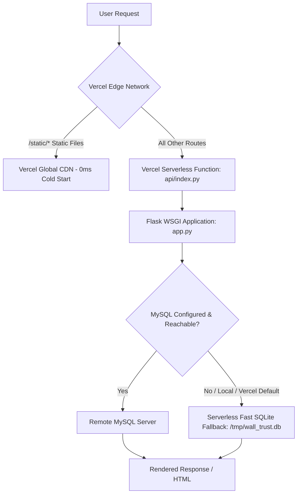
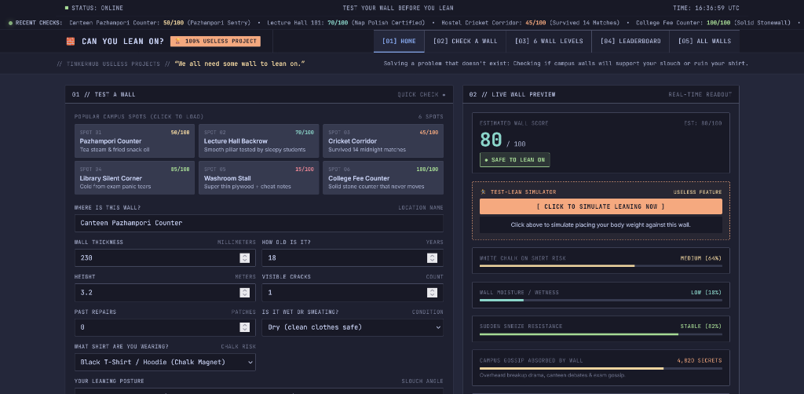
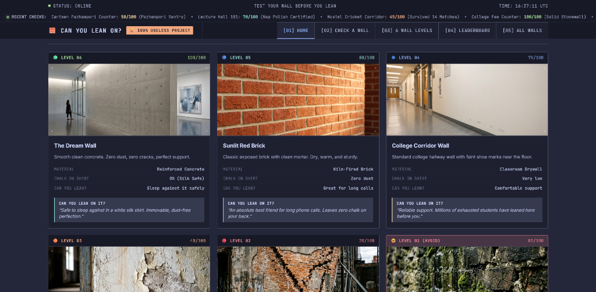
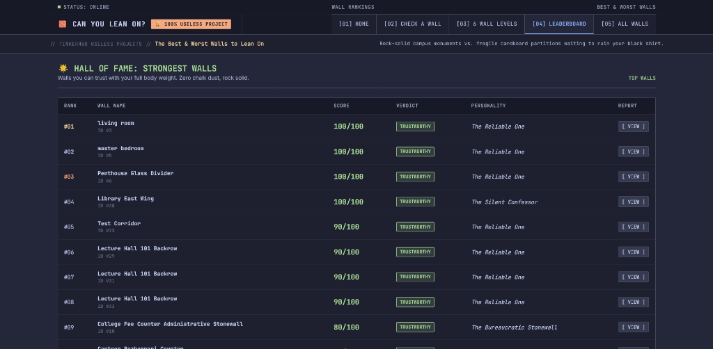

# CAN YOU LEAN ON? 🎯 (Vercel Edition)

> *"We all need some wall to lean on."*

A satirical, Apple-grade architectural telemetry platform that answers humanity's most pressing unanswered question: **"Can you lean on this wall without it collapsing or ruining your shirt with chalk powder?"** Features a proprietary 0–100 Trust Score algorithm, psychiatric wall profiling, red flag audits, and a 6-level visual scale ranging from pristine museum concrete to ancient weeping moss bogs.

This edition is fully pre-configured and optimized for **instant zero-downtime deployment on Vercel** using Serverless Python functions, edge asset distribution, and zero-config embedded SQLite failover.

---

## 🚀 Instant Vercel Deployment

Deploy this repository to Vercel in less than 2 minutes.

### Method 1: Deploy via Vercel Web Dashboard (Recommended)

1. **Push this repository to GitHub**:
   ```bash
   git remote add origin https://github.com/YOUR_USERNAME/wall-project-vercel.git
   git branch -M main
   git push -u origin main
   ```
2. Open [Vercel Dashboard](https://vercel.com/new).
3. Click **"Add New..."** > **"Project"** and select your GitHub repository.
4. **Build & Output Settings**: Leave all settings at default! Vercel automatically detects `vercel.json` and `api/index.py`.
5. *(Optional)* If you have an external MySQL database (PlanetScale, Supabase, Aiven, Railway), add these Environment Variables:
   - `DB_HOST`: Your MySQL host
   - `DB_USER`: Your MySQL user
   - `DB_PASSWORD`: Your MySQL password
   - `DB_NAME`: Your database name
   - `DB_PORT`: `3306` (or your custom port)
   
   *(If you don't add MySQL variables, the app automatically runs on embedded SQLite failover in `/tmp` with zero configuration required!)*
6. Click **Deploy**. Your app is live! 🎉

---

### Method 2: Deploy via Vercel CLI

```bash
# 1. Install Vercel CLI globally
npm i -g vercel

# 2. Deploy to preview
vercel

# 3. Deploy to production
vercel --prod
```

---

## 🛠️ Architecture & Vercel Optimizations



1. **Serverless Entrypoint (`api/index.py`)**: Seamless WSGI interface conforming to Vercel's modern Python runtime.
2. **Edge Asset Delivery (`public/static/` & `vercel.json`)**: CSS, JS, and high-resolution wall images are served directly by Vercel CDN at the edge.
3. **Zero-Config Database Failover**: On Vercel, if external MySQL credentials aren't provided, the app avoids timeout delays by seamlessly initializing a lightweight SQLite database seeded with demo Kerala campus specimens.

---

## 💻 Local Development

```bash
# 1. Clone or navigate into this folder
cd wall-project-vercel

# 2. Create virtual environment
python -m venv venv
.\venv\Scripts\activate      # Windows (PowerShell / CMD)
# source venv/bin/activate  # macOS / Linux

# 3. Install dependencies
pip install -r requirements.txt

# 4. Start the local server
python app.py

# 5. Open browser at:
# http://127.0.0.1:5000/
```

---

## 📸 Screenshots

### 1. Interactive Workbench & Live Telemetry


### 2. The 6 Levels of Wall Health


### 3. Certified Wall Report & Leaning Permission Dossier


### 4. Hall of Fame: Wall Trust Leaderboard


---

## 👤 Author
- **Kashinath P K**
- Made with ❤️ at TinkerHub Useless Projects
